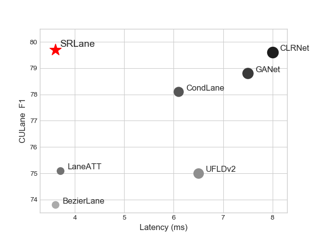

## Sketch and Refine: Towards Fast and Accurate Lane Detection



------

### Install
```bash
git clone https://github.com/passerer/SRLane.git
cd SRLane
conda create -n py38 python=3.8 -y # Create a new Python environment, optional.
conda activate py38 
pip install -r requirements.txt

# Install pytorch, modifying the CUDA version accordingly.
pip uninstall urllib3
pip uninstall urllib3
pip install "urllib3>=1.25.4,<1.27"

python setup.py develop

conda install -c conda-forge geos shapely
conda install -c conda-forge pathspec
conda install -c conda-forge tensorboard

imgaug/augmenters/color.py中2487行后加入
        if cls._LUT_CACHE is None:
            cls._LUT_CACHE = cls._generate_lut_table()

```
### DATASET
Download [CULane](https://xingangpan.github.io/projects/CULane.html). Then modify `dataset_path` in [configs/datasets/culane.py](configs/datasets/culane.py) accordingly.
### Train
Here is an example
```bash
CUDA_VISIBLE_DEVICES=0 python tools/main.py configs/exp_srlane_culane.py
```
### Test
#### Performance
Here is an example:
```bash
CUDA_VISIBLE_DEVICES=0 python tools/main.py configs/exp_srlane_culane.py --load_from checkpoint/baseline.pth --validate
```
The results should be:

|  SET  |  F1  |  SET  |  F1  |
|:-----:|:----:|:-----:|:----:|
| total |0.7973| noline|0.5565|
| normal|0.9352| arrow |0.8950|
| crowd |0.7858| curve |0.7527|
| hlight|0.7413| cross |1412 (FP)|
| shadow|0.8190| night |0.7458|

#### Runtime
Here is an example:
```bash
CUDA_VISIBLE_DEVICES=0 python tools/analysis_tools/speed_measure.py configs/exp_srlane_culane.py
```

### Acknowledgement

* [Turoad/CLRNet](https://github.com/Turoad/CLRNet/)
* [hirotomusiker/CLRerNet](https://github.com/hirotomusiker/CLRerNet)
